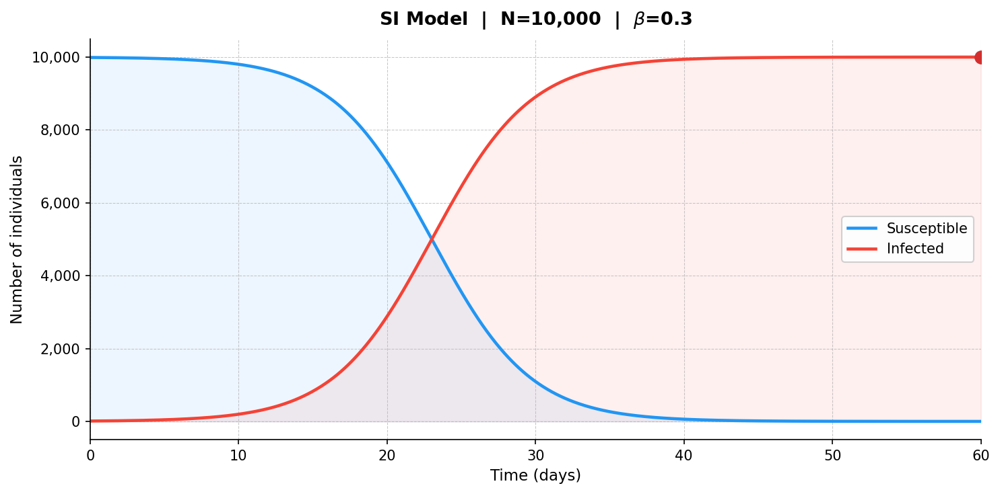
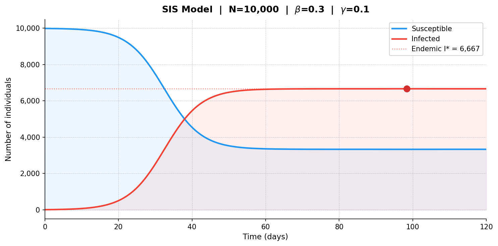
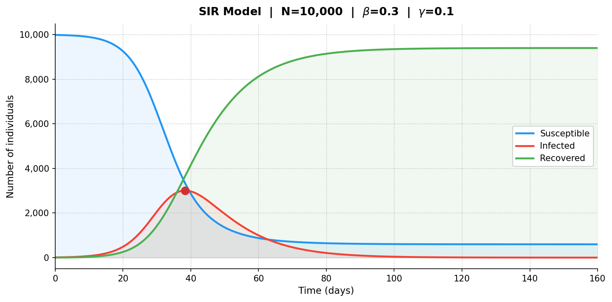
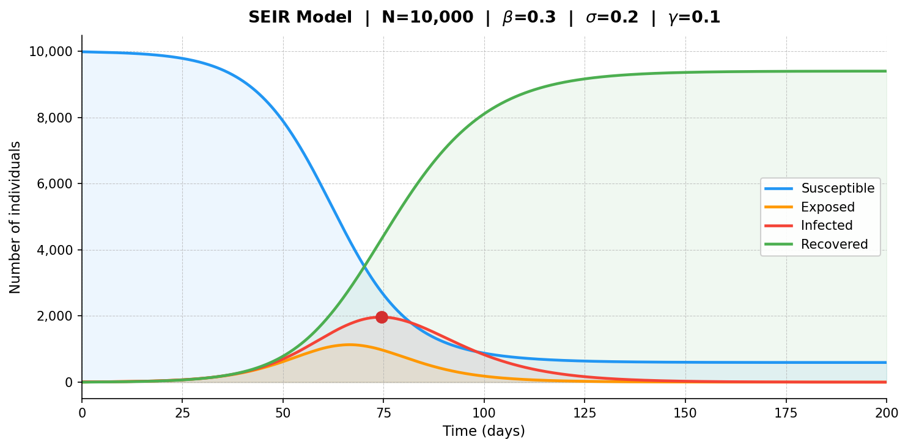
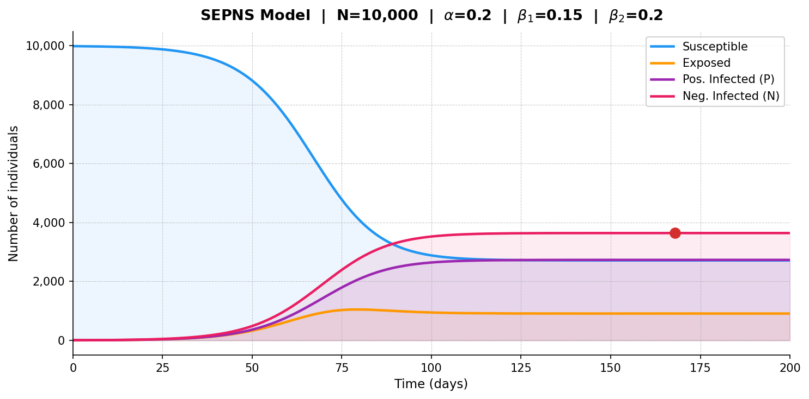
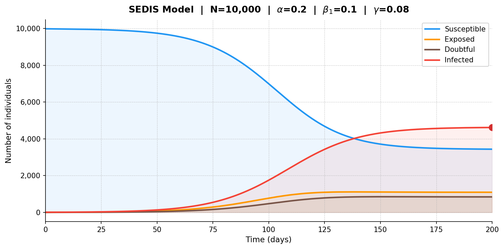
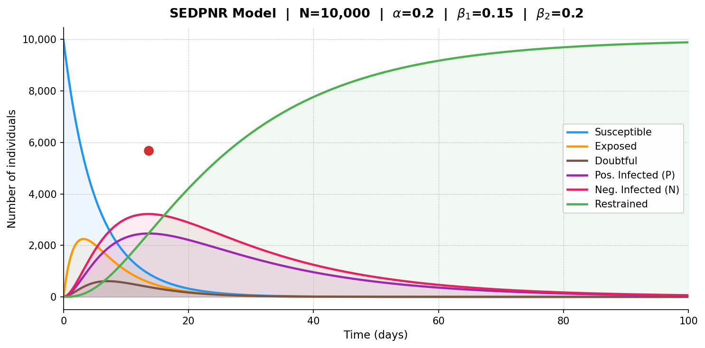

# Epidemic Model Simulator for Misinformation Spread

A Python simulation project for comparing classical epidemic models and misinformation-spread models in digital networks.

The project implements deterministic compartmental models using systems of ordinary differential equations. It includes traditional epidemic models such as SI, SIS, SIR, and SEIR, together with social-network misinformation models such as SEPNS, SEDIS, and SEDPNR.

The project is based on the paper:

**Sreeraag Govindankutty and Shynu Padinjappurath Gopalan, “Epidemic modeling for misinformation spread in digital networks through a social intelligence approach,” Scientific Reports, 2024.**

DOI: https://doi.org/10.1038/s41598-024-69657-0

## Overview

This repository studies how information, rumors, and misinformation can spread through a population by adapting epidemic-modeling ideas to digital networks.

The social-network models represent user behavior such as exposure to misinformation, uncertainty, sentiment-based spreading, rejection after verification, and eventual disengagement from spreading.

The simulations are implemented in `main.py`. Each model is solved with `scipy.integrate.solve_ivp` using the RK45 method and visualized with `matplotlib`. Generated plots are saved as PNG files in the `figs/` directory.

## Implemented Models

| Model | Full Name | Main Idea |
|---|---|---|
| SI | Susceptible, Infected | The simplest irreversible spread model. Susceptible individuals become infected, and infected individuals remain infected. |
| SIS | Susceptible, Infected, Susceptible | Infected individuals can return to the susceptible state, so the spread can persist over time. |
| SIR | Susceptible, Infected, Recovered | Infected individuals recover into a permanently immune or removed state. |
| SEIR | Susceptible, Exposed, Infected, Recovered | Adds a latent exposed state before individuals become infectious. |
| SEPNS | Susceptible, Exposed, Positively Infected, Negatively Infected, Susceptible | Splits misinformation spreaders into positive-sentiment and negative-sentiment spreaders. |
| SEDIS | Susceptible, Exposed, Doubtful, Infected, Susceptible | Adds a doubtful state for users who question the information before accepting, rejecting, or spreading it. |
| SEDPNR | Susceptible, Exposed, Doubtful, Positively Infected, Negatively Infected, Restrained | Combines doubt, sentiment-aware misinformation spreading, and a restrained state for users who permanently stop spreading the misinformation. |

## Project Structure

```text
.
├── main.py
├── Epidemic modeling for misinformation spread.pdf
├── LICENSE
└── figs
    ├── SI_model_ex.png
    ├── SIS_model_ex.png
    ├── SIR_model_ex.png
    ├── SEIR_model_ex.png
    ├── SEPNS_model_ex.png
    ├── SEDIS_model_ex.png
    └── SEDPNR_model_ex.png
```

## Requirements

Python 3.9 or newer is recommended.

| Dependency | Purpose |
|---|---|
| `numpy` | Numerical arrays and simulation time grids |
| `scipy` | Solving ODE systems with `solve_ivp` |
| `matplotlib` | Plotting and saving simulation figures |

## Installation

Clone the repository:

```bash
git clone https://github.com/YOUR_USERNAME/YOUR_REPOSITORY_NAME.git
cd YOUR_REPOSITORY_NAME
```

Create and activate a virtual environment:

```bash
python -m venv .venv
source .venv/bin/activate
```

On Windows PowerShell, use:

```powershell
python -m venv .venv
.venv\Scripts\Activate.ps1
```

Install the required dependencies:

```bash
pip install numpy scipy matplotlib
```

## Usage

Run the simulator:

```bash
python main.py
```

The script runs all implemented models, prints the main parameters and peak-spread information to the terminal, saves the generated PNG figures into the `figs/` directory, and displays the plots.

## Output Figures

| Model | Output File | Preview |
|---|---|---|
| SI | `figs/SI_model_ex.png` |  |
| SIS | `figs/SIS_model_ex.png` |  |
| SIR | `figs/SIR_model_ex.png` |  |
| SEIR | `figs/SEIR_model_ex.png` |  |
| SEPNS | `figs/SEPNS_model_ex.png` |  |
| SEDIS | `figs/SEDIS_model_ex.png` |  |
| SEDPNR | `figs/SEDPNR_model_ex.png` |  |

## Model Descriptions

### SI Model

The SI model divides the population into susceptible and infected individuals. Once an individual becomes infected, they remain infected. This model is useful as a baseline for irreversible information spread.

The transmission rate `beta` controls how quickly susceptible individuals become infected.

### SIS Model

The SIS model allows infected individuals to return to the susceptible state. This is useful for processes where there is no permanent immunity or permanent disengagement.

In this implementation, `beta` controls transmission and `gamma` controls the transition from infected back to susceptible.

### SIR Model

The SIR model adds a recovered compartment. Infected individuals recover and move into a state where they no longer participate in the spread.

In this implementation, `beta` controls transmission and `gamma` controls recovery.

### SEIR Model

The SEIR model adds an exposed compartment between susceptible and infected. Exposed individuals have encountered the spreading item and later transition into the infected state.

In this implementation, `beta` controls exposure, `sigma` controls the transition from exposed to infected, and `gamma` controls recovery.

### SEPNS Model

The SEPNS model adapts epidemic modeling to social-network misinformation spread by splitting infected users into two sentiment-based groups.

Positive spreaders share misinformation with a positive or approving tone. Negative spreaders share misinformation with a negative, critical, or emotionally reactive tone. Both groups can return to the susceptible state because rumor-specific social spreading does not imply permanent immunity.

### SEDIS Model

The SEDIS model introduces a doubtful compartment. This state represents users who have encountered misinformation and are deciding whether to believe, reject, or spread it.

This model is useful for representing skepticism, verification behavior, and delayed decision-making in online information diffusion.

### SEDPNR Model

The SEDPNR model is the most complete misinformation-spread model in this project.

| Symbol | Compartment | Meaning |
|---|---|---|
| `S` | Susceptible | Users who have not adopted or engaged with the misinformation yet |
| `E` | Exposed | Users who have encountered the misinformation |
| `D` | Doubtful | Users who are skeptical or verifying the information |
| `P` | Positively Infected | Users spreading the misinformation with positive sentiment |
| `N` | Negatively Infected | Users spreading the misinformation with negative sentiment |
| `R` | Restrained | Users who have stopped spreading the misinformation |

The model captures initial exposure, doubt, sentiment-based spreading, rejection after verification, and eventual restraint.

## Default Simulation Parameters

The parameters are configured directly in `main.py`.

| Model | Population | Initial Conditions | Main Rates | Simulation Length |
|---|---:|---|---|---:|
| SI | 10,000 | 10 infected | `beta = 0.30` | 60 days |
| SIS | 10,000 | 10 infected | `beta = 0.30`, `gamma = 0.10` | 120 days |
| SIR | 10,000 | 10 infected, 0 recovered | `beta = 0.30`, `gamma = 0.10` | 160 days |
| SEIR | 10,000 | 0 exposed, 10 infected | `beta = 0.30`, `sigma = 0.20`, `gamma = 0.10` | 200 days |
| SEPNS | 10,000 | 0 exposed, 5 positively infected, 5 negatively infected | `alpha = 0.20`, `beta1 = 0.15`, `beta2 = 0.20`, `mu1 = 0.05`, `mu2 = 0.05`, `mu_e = 0.03` | 200 days |
| SEDIS | 10,000 | 0 exposed, 0 doubtful, 10 infected | `alpha = 0.20`, `beta1 = 0.10`, `beta2 = 0.15`, `gamma = 0.08`, `mu1 = 0.04`, `mu2 = 0.05`, `mu3 = 0.05` | 200 days |
| SEDPNR | 10,000 | 10 exposed, 10 doubtful, 5 positively infected, 5 negatively infected, 0 restrained | `alpha = 0.20`, `beta1 = 0.15`, `beta2 = 0.20`, `beta3 = 0.10`, `beta4 = 0.12`, `gamma = 0.10`, `lambda1 = 0.05`, `lambda2 = 0.05`, `mu1 = 0.03`, `mu2 = 0.04` | 100 days |

## Customizing the Simulation

To change a simulation, edit the corresponding parameter object in `main.py`.

For example, the SEDPNR parameters are configured like this:

```python
sedpnr_params = SEDPNRParams(
    population           = 10_000,
    initial_exposed      = 10,
    initial_doubtful     = 10,
    initial_pos_infected = 5,
    initial_neg_infected = 5,
    initial_restrained   = 0,
    alpha                = 0.20,
    beta1                = 0.15,
    beta2                = 0.20,
    beta3                = 0.10,
    beta4                = 0.12,
    gamma                = 0.10,
    lambda1              = 0.05,
    lambda2              = 0.05,
    mu1                  = 0.03,
    mu2                  = 0.04,
    t_end                = 100.0,
    t_steps              = 1_000,
)
```

After changing the parameters, rerun:

```bash
python main.py
```

The figures in `figs/` will be regenerated.

## Reproducibility

The current implementation is deterministic. It solves ordinary differential equations instead of running a random agent-based simulation. Running the same code with the same parameters should produce the same curves.

| Setting | Value |
|---|---:|
| ODE solver | `scipy.integrate.solve_ivp` |
| Solver method | `RK45` |
| Figure size | `10 x 5` inches |
| Figure DPI | `150` |
| Output directory | `figs` |

## Notes on Interpretation

The generated curves show compartment-level dynamics under the chosen parameters. They are useful for studying qualitative behavior such as infection peaks, exposed-population growth, sentiment-specific spread, decline of spreaders, and growth of the restrained population.

The plots provide qualitative model behavior rather than calibrated predictions for a specific real-world social network. Operational use would require empirical calibration, platform-specific assumptions, network topology, user-behavior data, and validation.

## Reference

```bibtex
@article{govindankutty2024epidemic,
  title   = {Epidemic modeling for misinformation spread in digital networks through a social intelligence approach},
  author  = {Govindankutty, Sreeraag and Gopalan, Shynu Padinjappurath},
  journal = {Scientific Reports},
  volume  = {14},
  article = {19100},
  year    = {2024},
  doi     = {10.1038/s41598-024-69657-0}
}
```

## License

This project is licensed under the MIT License. See the `LICENSE` file for details.

## Acknowledgment

This project is based on the ideas presented in the Scientific Reports article “Epidemic modeling for misinformation spread in digital networks through a social intelligence approach.”
